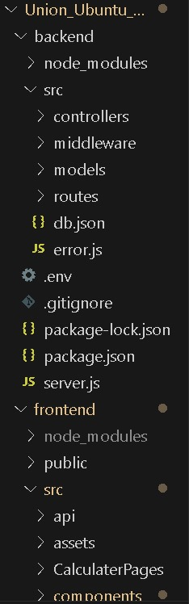
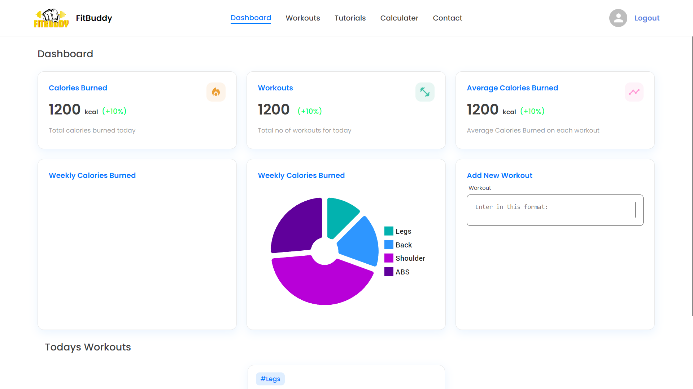
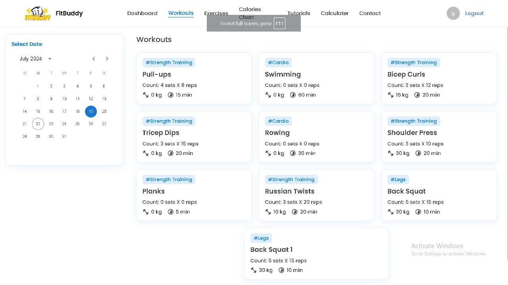
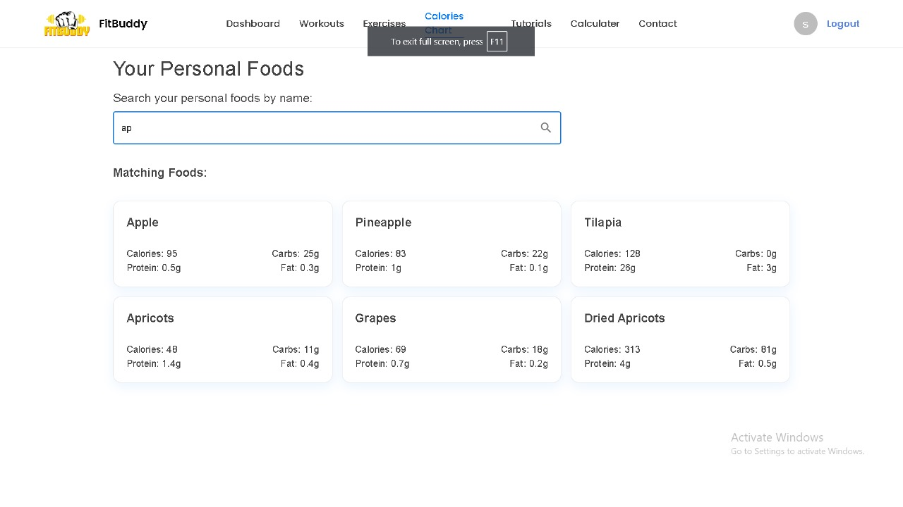
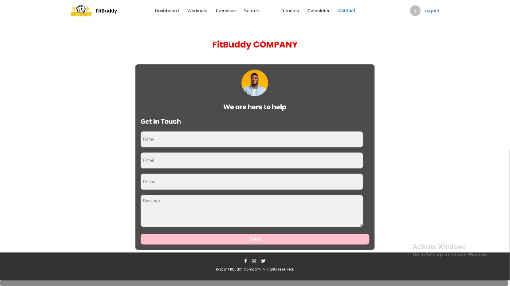
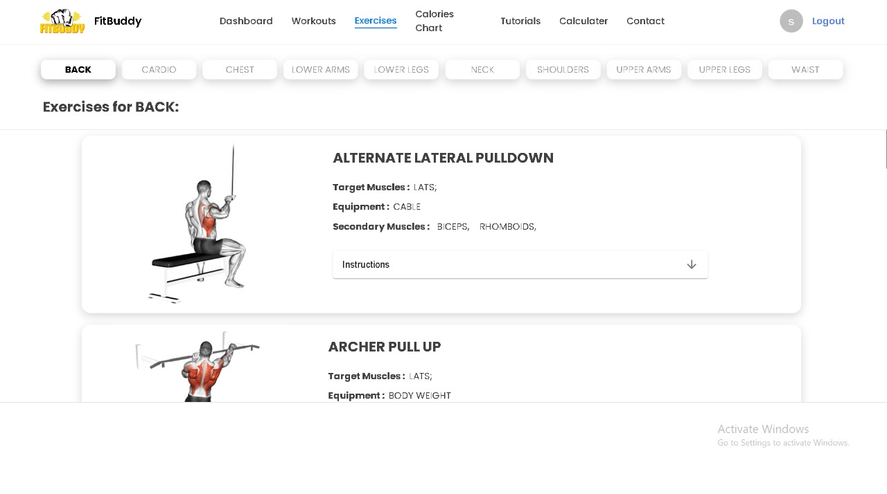
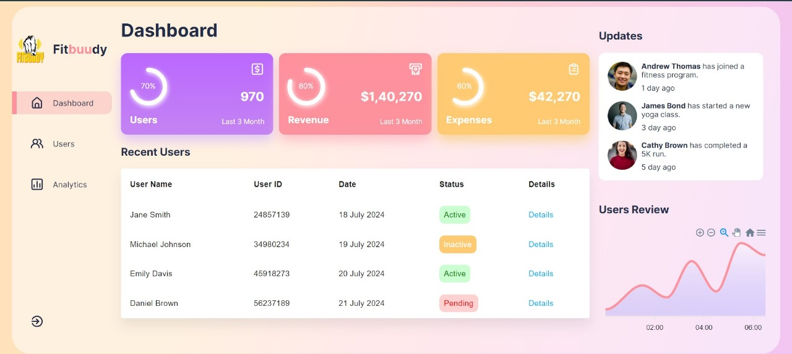

# FitBuddy

Fitbuddy is a comprehensive fitness app designed to support users in tracking and managing their workout routines, meal intake, and overall fitness progress. It offers features like detailed workout logging, nutritional tracking, calendar integration for scheduling fitness activities, and progress monitoring tools. Fitbuddy aims to help users achieve their fitness goals through personalized workout and meal plans, while also fostering a supportive community through social features and professional advice.

## Project Type
- Frontend | Backend

## Deployed Link
- FitBuddy: [Live Demo](https://union-ubuntu-046.vercel.app/)

## Directory Structure


## Video Walkthrough of the Project
- [Presentation Link](https://youtu.be/KAi-4gsl1bU)

## Screenshots

**Landing Page**


**Login and Signup Page**


**Workout Detail Page**


**Search Page**


**Contact Detail Page**


**Exercise Detail Page**


**Admin Dashboard**


## Features
- **Login and Signup**: Effortlessly access exclusive deals by logging in or signing up for personalized experiences.
- **Responsive and Dynamic**: The website adapts seamlessly to any device, ensuring a smooth and intuitive experience across desktop, tablet, and mobile.
- **Admin Dashboard (CRUD Operations)**: For authorized users, admins can manage the platform effectively with a comprehensive dashboard, enabling them to Create, Read, Update, and Delete courses, user accounts, and other critical data.
- **Search Bar**: Easily find the food you want with our intuitive search bar.
- **Add to Workout**: Allows users to log and customize their exercise routines, track details like sets and reps, and save workouts for future use.
- **Calculator**: This feature lets users calculate calories count, BMI, calorie needs, body fat, and calorie intake.

## Technology Stack
- **HTML**: Provides the structure and content for the web page.
- **CSS**: Handles the UI and styling, ensuring an appealing visual presentation.
- **JavaScript**: Empowers dynamic and interactive web experiences through its versatile scripting capabilities.
- **JSON Server**: Simplifies backend development by quickly creating a REST API with JSON data, streamlining the development process and enabling rapid prototyping.
- **Material UI**: Provides responsive designs that adapt to different screen sizes.
- **React.js**: A JavaScript library for building user interfaces.

## Design Elements
- **Interactive**: Cards have rounded borders with light blue shadows to enhance the interactive feel.
- **Flex and Grid**: Many elements use flex and grid to provide more control over the layout in different sections of the website.
- **Fonts & Icons**: The website integrates React Fonts for enhanced visual elements, achieving a modern and visually appealing design that improves readability and user engagement.

## Installation & Getting Started

To run the frontend website, follow these steps:

`````````bash
# Clone this repository to your local machine
git clone https://github.com/gaman5575/FitBuddy.git

# Move into the FrontEnd Directory
cd frontEnd/

# Install all dependencies
npm install

# Run the dev server
npm run dev

## Installation & Getting Started

### Clone the Repository
To get started, clone this repository to your local machine:

`````````bash
git clone https://github.com/gaman5575/FitBuddy.git


Set Up the Frontend
Move into the Frontend directory:

`````````bash
Copy
cd frontEnd/
Install the necessary dependencies:

``````bash
Copy
npm install
Run the development server:

``````bash
Copy
npm run dev
The frontend will be available on http://localhost:5173.

Backend Setup (Mock Server)
The project uses a mock server deployed using JSON-server on Render. You can access the server here: [Link to API].

If you'd prefer to run a local server, follow these steps:

Move into the Backend directory:

``````bash
Copy
cd backEnd/
Run the backend server:

``````bash
Copy
npm run start
The backend will be available on http://localhost:5000.


Deployment on EC2 Using Docker
If you wish to deploy the app on an EC2 instance using Docker, follow the steps below:

EC2 Instance Configuration
Set up an EC2 instance with the following specifications:

Ubuntu 20.04 or later.
At least 2GB of RAM and 1 vCPU.
Open the necessary ports in the security group (e.g., 80 for frontend and 5000 for backend communication).
Install Docker on the EC2 instance. Follow the official Docker Installation Guide.

Docker Configuration
Create Docker images for both the frontend and backend.

Use Docker Compose to manage the services if needed, or run them separately.

For the frontend, you need to build the Docker image from the Dockerfile and expose the correct ports (5173:80 for frontend).

For the backend, make sure to expose port 5000 and set the CLIENT_URL to the EC2 public IP.

Running Docker Containers on EC2
Use the following Docker commands to run both the frontend and backend:

Frontend
```bash
docker run -d --name fitbuddy-frontend --network fitbuddy-network -p 5173:80 -e VITE_API_URL=http://<EC2_PUBLIC_IP>:5000/api fitbuddy-frontend
Backend
```bash

docker run -d --name fitbuddy-backend --network fitbuddy-network -p 5000:5000 -e CLIENT_URL=http://<EC2_PUBLIC_IP>:5173 -e mongo_url="mongodb+srv://<db_credentials>" -e JWT=<your_jwt_key> fitbuddy-backend

Accessing the Application
Frontend: http://<EC2_PUBLIC_IP>:5173
Backend: http://<EC2_PUBLIC_IP>:5000


**Contributors**
Shobhit Gupta

**Acknowledgments**
Inspired by the original FitBuddy website.
Special thanks to our dedicated team for their invaluable contributions to FitBuddy.
vbnet


This structure clearly outlines each step needed for local development, deployment on EC2 using Docker, and additional credits.


